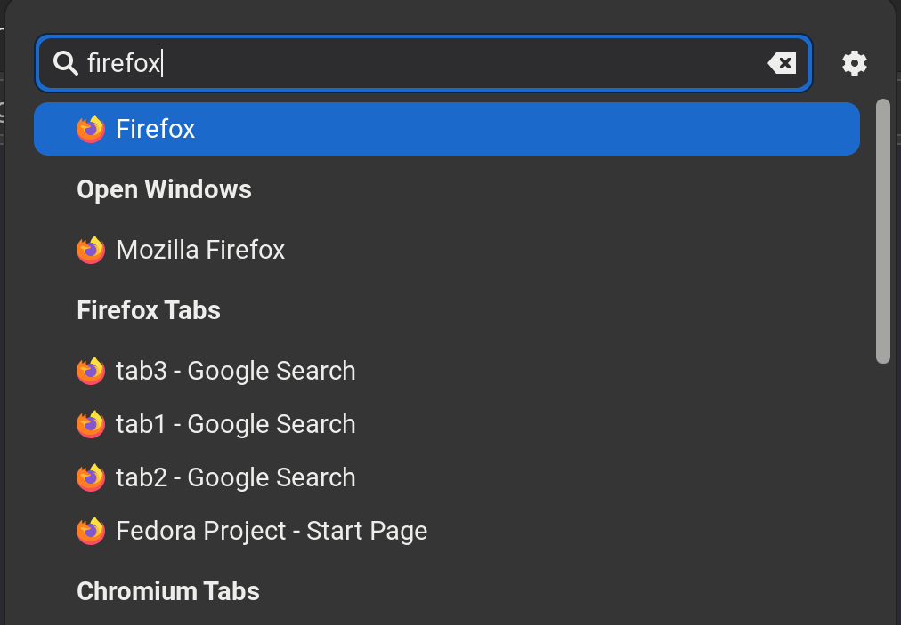

# What is this ?
This is repository provides browser tab search provider for [GNOME](https://www.gnome.org/)
### Screenshot


# Installation
Installl all 3 components for tab search to work
1. [Browser extension](#browser-extension)
1. [Shell extension](#shell-extension)
1. [Host connector](#host-connector)


## Browser extension

<a href="https://addons.mozilla.org/en-US/firefox/addon/tab-search-provider-for-gnome/">

</a>

## Shell extension
<a href="https://extensions.gnome.org/extension/4733/browser-tabs/">

</a>

Or from source
```
cd shellextension
yarn
yarn build
yarn extension:install
```

## Host connector
### For Fedora Linux
Install from [copr](https://copr.fedorainfracloud.org/coprs/harshadgavali/searchproviders/)
```
sudo dnf copr enable harshadgavali/searchproviders
sudo dnf install tabsearchproviderconnector
```

### Install from releases
* Download zip of latest release from [here](https://github.com/harshadgavali/searchprovider-for-browser-tabs/releases/)
```
# first verify what files zip has
zip -sf gnome-tabsearchprovider-connector.connector-*.zip
# output should have following files
# - etc/opt/chrome/native-messaging-hosts/com.github.harshadgavali.tabsearchproviderconnector.json
# - usr/bin/com.github.harshadgavali.tabsearchproviderconnector
# - usr/lib64/mozilla/native-messaging-hosts/com.github.harshadgavali.tabsearchproviderconnector.json

sudo unzip -o -d / gnome-tabsearchprovider-connector.connector-*.zip

# create link for file from lib64 to lib
sudo mkdir -p /usr/lib/mozilla/native-messaging-hosts/
sudo ln -s /usr/lib{64,}/mozilla/native-messaging-hosts/com.github.harshadgavali.tabsearchproviderconnector.json
```

### Install from git
**Dependencies**: meson, ninja, cargo, rust
```
cd connector
meson --prefix=/usr build
ninja -C build install

# create link for file from lib64 to lib
sudo mkdir -p /usr/lib/mozilla/native-messaging-hosts/
sudo ln -s /usr/lib{64,}/mozilla/native-messaging-hosts/com.github.harshadgavali.tabsearchproviderconnector.json
```

#### If you installed browser addons in different way
* Then update manifest in following locations 
with ids of browser addons
  * /etc/opt/chrome/native-messaging-hosts/
  * /usr/lib64/mozilla/native-messaging-hosts/

#### After installation
* Open browser
* Start searching with `Super` key
  * Browser tabs(except active tabs) will appear in search results
